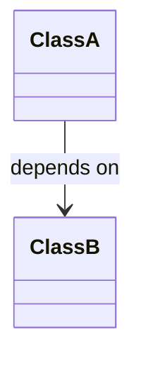

# Code Analysis Knowledge Base — Schema

## Purpose

<!-- CUSTOMIZE: Replace this with a one-paragraph description of the codebase you are analyzing. -->
<!-- Examples: "the FastAPI web framework source code", "the internal billing microservice", "the React frontend for the customer portal" -->
This is an LLM-maintained knowledge base for analyzing a software codebase. The LLM writes and maintains all files under `wiki/`. The human directs analysis tasks. The human never edits wiki files directly.

## Directory Layout

- `raw/` — Immutable source snapshots, dependency manifests, architecture notes. Never modify these.
- `wiki/index.md` — Master catalog. Every wiki page must appear here.
- `wiki/log.md` — Append-only activity log.
- `wiki/classes/` — One page per class or major data structure.
- `wiki/functions/` — One page per significant function or method.
- `wiki/apis/` — One page per API endpoint or public interface.
- `wiki/libraries/` — One page per third-party dependency or library.
- `wiki/patterns/` — Design patterns identified in the codebase.
- `wiki/anti-patterns/` — Anti-patterns and technical debt identified in the codebase.
- `wiki/modules/` — One page per module, package, or significant file grouping.
- `wiki/journal/` — Analysis session journal entries.
- `wiki/deep-dive/` — Generated technical deep dive documents.
- `wiki/images/` — SVG and image files referenced by wiki pages. Served by the Express app at `/api/wiki/image?path=<wiki-root-relative-path>`.

## File Naming

- All lowercase, hyphens for word separation: `my-class-name.md`
- No spaces, no special characters, no uppercase
- Name should match the page title slug (e.g., `UserService` → `user-service.md`)

## Image and Diagram Conventions

**Option A — Static SVG files** (architecture diagrams, component maps)

- Save to `wiki/images/<slug>.svg`
- Reference with a path relative to the current file:
  - From `wiki/classes/`: ``
  - From `wiki/modules/`: ``

**Option B — Mermaid diagrams** (class diagrams, sequence diagrams, dependency graphs)

````text

````

- Rendered into inline SVG by the frontend automatically
- Best for: class diagrams, sequence diagrams, dependency graphs, ER diagrams

**When to create a diagram:**

- A class or module has 3+ dependencies where the relationships are the key insight
- A function has a multi-step process flow with branching
- A module boundary or architecture layer needs to be shown visually

**Default stance: no diagram unless it replaces 50+ words of description.** Prose is usually clearer for single relationships.

**Limits:** Maximum 1 diagram per wiki page.

## Page Format

Every wiki page uses this frontmatter:

```yaml
---
title: "Page Title"
type: class | function | api | library | pattern | anti-pattern | module | journal
tags: [tag1, tag2, tag3]
created: YYYY-MM-DD
updated: YYYY-MM-DD
source_files: ["src/path/to/file.js"]
language: javascript | python | typescript | java | go | rust | other
confidence: high | medium | low
---
```

Note: `source_files` replaces the research vault's `sources` field. `language` is required for class, function, api, pattern, anti-pattern, and module pages.

### Required Sections by Page Type

**Class pages** (`wiki/classes/`):

- `## Definition` — One-paragraph description of the class's responsibility and role in the architecture
- `## Properties` — Table of properties: name, type, visibility, description
- `## Methods` — Table of methods: name, parameters, return type, description
- `## Dependencies` — What this class depends on (imports, injections, inherited classes) — link to class/library pages
- `## Patterns Used` — Links to pattern pages for patterns this class implements
- `## Related Classes` — Wiki links to related class pages

**Function pages** (`wiki/functions/`):

- `## Signature` — Full function signature with types
- `## Purpose` — One-paragraph description of what this function does and why
- `## Parameters` — Table: name, type, default, description
- `## Return Value` — Type and description of the return value
- `## Side Effects` — Any state mutations, I/O, or other side effects (write "None" if pure)
- `## Called By` — Links to function/class pages that call this function
- `## Calls` — Links to function pages this function calls

**API endpoint pages** (`wiki/apis/`):

- `## Endpoint` — Full URL path (e.g., `GET /api/wiki/files`)
- `## Method` — HTTP method (GET, POST, PUT, DELETE, PATCH)
- `## Auth` — Authentication requirements (none, API key, JWT, session, etc.)
- `## Request Schema` — Query parameters and/or request body schema (JSON or table)
- `## Response Schema` — Response body schema with example
- `## Error Codes` — Table: HTTP status, error condition, description
- `## Related Endpoints` — Links to related API pages

**Library pages** (`wiki/libraries/`):

- `## Purpose` — Why this library is in the project; what problem it solves
- `## Version Pinned` — Current version and whether it is pinned in the dependency file
- `## Key APIs Used` — Which specific APIs/functions from this library the project actually uses
- `## Why Chosen` — Decision rationale for selecting this library over alternatives
- `## Alternatives Considered` — Other libraries evaluated and why they were rejected (write "Unknown" if not documented)

**Pattern pages** (`wiki/patterns/`):

- `## Intent` — What problem this pattern solves in this codebase
- `## Structure` — Mermaid class/sequence diagram or prose description of how the pattern is implemented
- `## Where Used in Codebase` — File:line references to concrete implementations (e.g., `src/server/index.js:45`)
- `## Trade-offs` — Benefits and drawbacks of this pattern in this codebase's context
- `## Related Patterns` — Links to related pattern pages

**Anti-pattern pages** (`wiki/anti-patterns/`):

- `## What It Is` — Description of the anti-pattern and why it is problematic
- `## Where Found` — File:line references to instances in the codebase (e.g., `src/legacy/auth.js:120`)
- `## Impact` — Concrete consequences (performance, maintainability, correctness, security)
- `## Recommended Refactor` — How to fix each instance; include a code sketch if helpful

**Module pages** (`wiki/modules/`):

- `## Responsibility` — Single-paragraph description of what this module owns and why it exists
- `## Public Exports` — Table of exported symbols: name, type (class/function/constant), description
- `## Internal Dependencies` — Links to other module pages this module imports from
- `## External Dependencies` — Links to library pages for third-party dependencies used

**Journal pages** (`wiki/journal/`):

- Named `journal-<session-slug>-<YYYY-MM-DD>.md`; if a same-day same-slug file exists, append `-v2`, `-v3`, etc.
- Capture session reasoning, not analysis content — wiki pages hold the knowledge; journal entries hold the process notes
- Additional frontmatter fields: `session_type: analyze | query | lint | mixed`, `wiki_pages_consulted: [...]`, and `outcome: "<one-line summary>"`
- `## Setup` — What was being analyzed; the starting goal
- `## Process` — Steps taken, files read, decisions made; focus on reasoning
- `## Result` — What was produced; links to new or updated wiki pages
- `## What Went Well` — What worked as expected or better
- `## What Could Improve` — Gaps, follow-up questions, stale references found

## Linking Conventions

- Use standard Markdown relative links: `[Display Text](relative/path.md)`
- Always include the `.md` extension in link targets
- Paths must be relative to the **current file's location**, not the wiki root
  - Same folder: `[UserService](user-service.md)`
  - Sibling folder (e.g., from `classes/` to `libraries/`): `[Express](../libraries/express.md)`
  - From `functions/` to `classes/`: `[UserService](../classes/user-service.md)`
- Every page must link to at least one other page (no orphans)
- When referencing a class, function, or library that has a page, always link it

## Tagging Taxonomy

<!-- CUSTOMIZE: Adjust these tags to match your codebase's technology stack and architecture. -->

- **Language**: `javascript`, `python`, `typescript`, `java`, `go`, `rust`, `other`
- **Layer**: `frontend`, `backend`, `database`, `infrastructure`, `testing`, `shared`
- **Concern**: `routing`, `authentication`, `state-management`, `rendering`, `data-access`, `configuration`, `validation`, `error-handling`
- **Quality**: `well-structured`, `needs-refactor`, `technical-debt`, `performance-critical`
- **Status**: `stable`, `in-development`, `deprecated`, `experimental`

## Confidence Levels

- **high** — Source code directly read and analyzed; multiple cross-references confirm the structure; no inferred gaps
- **medium** — Inferred from partial reading or a single file; may be missing context from unread files or indirect callers
- **low** — Based on naming conventions, comments, or documentation alone; source not fully analyzed

## Workflows

### Analyze

When the user says "analyze [file-or-directory]":

1. Verify the path exists using Glob or Bash
2. Read all source files at the path (recursively if a directory)
3. Identify all classes, functions, API endpoints, and design patterns
4. For each identified element:
   - Create the wiki page if it does not exist
   - Update the page with new information if it does exist
   - Use `source_files` frontmatter to record the file:line location
5. For each `import`/`require`/dependency statement, create or update a library page
6. Identify design patterns (middleware pattern, factory, observer, etc.) and create pattern pages
7. Identify anti-patterns (god objects, deeply nested callbacks, etc.) and create anti-pattern pages
8. Add cross-links in both directions between all touched pages
9. Update `wiki/index.md` and `wiki/log.md`
10. Invoke the `journal` skill: `Skill({ skill: "journal", args: "analyze: <path>" })`
11. Invoke the `document-project` skill: `Skill({ skill: "document-project" })`

### Analyze Dependencies

When the user says "analyze-deps" or "analyze dependencies":

1. Find dependency files: `package.json`, `requirements.txt`, `Cargo.toml`, `go.mod`, `pom.xml`, `build.gradle`
2. For each declared dependency: create or update a library page
3. Record version, stated purpose (if in comments), and whether it is pinned
4. Update `wiki/index.md` and `wiki/log.md`

### Query

When the user asks a question about the codebase:

1. Read `wiki/index.md` to find relevant pages
2. Read those pages
3. Synthesize an answer citing specific wiki pages with links and `source_files` locations
4. If the answer reveals a significant cross-cutting pattern worth preserving, create a pattern or anti-pattern page

### Lint

When the user says "lint" or "health check":

1. Read all wiki pages
2. Check for:
   - **Orphan pages** — no inbound links from any other wiki page
   - **Missing cross-links** — a page mentions a class/function/library by name but does not link it
   - **Stale source_files references** — a page's `source_files` field references a file path that no longer exists in the codebase (check with Glob/Bash)
   - **Broken file:line references** — Where Found / Calls / Called By sections cite `file.js:NNN` but that line no longer exists
   - **Incomplete sections** — required sections are empty or contain only placeholder text
   - **Modules without dependency links** — module pages that have no entries in Internal Dependencies or External Dependencies
3. Auto-fix what can be fixed: add missing cross-links, update orphan back-links
4. Report stale source_files and broken file:line references as human-judgment items (file may have moved or been refactored)
5. Update `wiki/log.md`
6. Invoke the `journal` skill: `Skill({ skill: "journal", args: "lint" })`

### Document Project

When the user says "document-project", "document project", or "generate deep dive":

1. Invoke the `document-project` skill: `Skill({ skill: "document-project" })`

The skill reads all existing wiki pages and source files, then generates a comprehensive Technical Deep Dive document saved to `wiki/deep-dive/technical-deep-dive.md`. Run `analyze` first to ensure the wiki is populated.

### Journal

When the user says "journal" or "journal [description]":

Invoke the `journal` skill: `Skill({ skill: "journal", args: "<description>" })`

The skill captures the current session into a structured journal entry. Session types for code-analysis vaults: `analyze`, `query`, `lint`, `mixed`.

### Help

When the user says "help", "/help", "what can you do", "what commands are available", or any similar request for guidance:

Invoke the `help` skill:
`Skill({ skill: "help" })`

The skill detects the vault type and prints a complete formatted guide of all available operations with usage examples.

## Rules

- Never modify files in `raw/`
- Always update `index.md` and `log.md` after any wiki change
- Prefer updating existing pages over creating duplicates
- Use `source_files` to record where in the codebase each page's information comes from
- When a page's source file changes, update the page and flag the change in `log.md`
- When in doubt about a class's behavior, set confidence to "low" and note the uncertainty
- Keep pages focused — one class/function/module per page
- Use plain English — define jargon on first use in each page
- All dates in ISO 8601 format: YYYY-MM-DD
- Record file:line references as `filename.js:NNN` (not full absolute paths)
- Never fabricate implementation details — only document what is directly observable in source code
