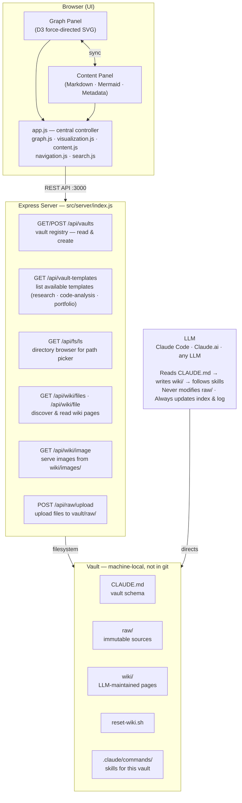

# Knowledge Compiler

An LLM-powered knowledge base platform with a browser-based interactive graph viewer. You create **vaults** — independent knowledge bases, each with its own schema and skill set — and direct an LLM to build and maintain them. A force-directed graph lets you navigate every page and the links between them visually.

Built on [Andrej Karpathy's "LLM Wiki" pattern](https://gist.github.com/karpathy/442a6bf555914893e9891c11519de94f).

---

## What Is a Vault?

A vault is a self-contained knowledge base with its own:

- `raw/` — immutable source documents (articles, PDFs, transcripts, code)
- `wiki/` — LLM-written and maintained pages, all cross-linked
- `CLAUDE.md` — the schema governing how the LLM operates in this vault
- `.claude/commands/` — the skills (operations) available in this vault
- `reset-wiki.sh` — script to reset the vault to a pristine empty state

**Three vault templates are available:**

| Template | Best For | Wiki Page Types |
| -------- | -------- | --------------- |
| `research` | Articles, papers, newsletters, domain knowledge | concept, entity, summary, synthesis, newsletter, journal |
| `code-analysis` | Analyzing software codebases | class, function, api, library, pattern, anti-pattern, module, journal |
| `portfolio` | Personal financial portfolio tracking | holding, watchlist, thesis, decision, sector, asset-class, performance-snapshot, asset, liability, net-worth-snapshot |

Vaults are registered in `vaults.json` at the project root and selected via a dropdown in the UI. Each vault is fully independent — different schema, different skills, different wiki content.

---

## Quick Start

**Prerequisites:** Node.js v18+. Python 3.8+ and pip (required for URL and PDF ingestion). Tesseract OCR (`brew install tesseract` on macOS) for PDF Stage 2. `ANTHROPIC_API_KEY` in your environment for PDF Stage 3 (Claude Vision fallback).

```bash
# From the repo root
./start.sh
```

`start.sh` kills any existing process on port 3000, installs Node dependencies on first run, and starts the server at `http://localhost:3000`. Or manually:

```bash
cd src
npm install   # first run only
node server/index.js
```

### Creating Your First Vault

1. Open `http://localhost:3000` in your browser
2. Click the **+** button next to the vault selector
3. Enter a name, choose a directory, select a template (`research`, `code-analysis`, or `portfolio`), and describe the purpose
4. The server creates the full directory structure, copies the appropriate CLAUDE.md and skills, and registers the vault
5. Open the vault directory in Claude Code (or any LLM tool that reads CLAUDE.md) and start working

---

## Architecture



### Component Breakdown

#### Browser Frontend (Vanilla JS + D3)

| Module | Responsibility |
| ------ | -------------- |
| `app.js` | Central controller; owns `activeVaultId`, `activeNodeId`, and graph state; orchestrates all modules via `navigateTo()` |
| `graph.js` | Fetches wiki file list, reads content in parallel, parses YAML frontmatter, extracts Markdown links, builds node/edge model |
| `visualization.js` | D3 force-directed SVG: pre-ticks simulation synchronously for stable initial positions, pan/zoom/drag, type filtering, fit-to-view |
| `content.js` | Renders Markdown to HTML via marked, sanitizes with DOMPurify, rewrites image paths, renders Mermaid diagrams |
| `navigation.js` | Breadcrumb trail (last 10 nodes), back/forward, keyboard shortcuts; suppresses shortcuts when any input is focused |
| `search.js` | Instant dropdown search across node names and file paths; integrates with type filter toggles |

#### Key Design Decisions

- *No JS framework* — the app is small enough that D3 + vanilla DOM manipulation covers everything without React/Vue overhead
- *Pre-ticking simulation* — the D3 force simulation runs ~300 ticks synchronously before first paint; eliminates the "graph settling" animation that would otherwise take 15–25 seconds
- *`skipCentre` flag on `navigateTo`* — separates "centre on a node" from "fit whole graph to view"; initial load and vault switch use fit-to-view, not node-centring
- *Server-backed directory browser* — the browser cannot expose OS filesystem paths from a native `<input type="file">` picker; the server `GET /api/fs/ls` endpoint drives an inline directory browser instead
- *Vault registry cache* — `_vaultRegistry` is cached in the server process and invalidated only when `POST /api/vaults` creates a new vault

#### Server (Node.js / Express)

A thin file-serving layer. It never modifies wiki files. It reads `vaults.json` at the project root to resolve vault paths; falls back to a legacy single-vault mode if no registry is present.

#### Vault Template System

Three-tier skills architecture:

```text
.claude/
├── commands/                          # 1. Universal skills (all vault types)
│   ├── create-vault.md
│   ├── help.md
│   ├── journal.md
│   └── lint.md
└── vault-templates/
    ├── research.md                    # CLAUDE.md template for research vaults
    ├── code-analysis.md               # CLAUDE.md template for code-analysis vaults
    ├── portfolio.md                   # CLAUDE.md template for portfolio vaults
    ├── scripts/
    │   ├── reset-wiki-research.sh
    │   ├── reset-wiki-code-analysis.sh
    │   └── reset-wiki-portfolio.sh
    └── skills/
        ├── research/                  # 2. Research vault-specific skills
        │   ├── ingest-url.md
        │   ├── ingest-pdf.md
        │   ├── research.md
        │   ├── newsletter.md
        │   ├── help.md
        │   └── lint.md
        ├── code-analysis/             # 2. Code-analysis vault-specific skills
        │   ├── analyze-code.md
        │   ├── document-project.md
        │   ├── help.md
        │   └── lint.md
        └── portfolio/                 # 2. Portfolio vault-specific skills
            ├── add-holding.md
            ├── add-asset.md
            ├── add-liability.md
            ├── refresh.md
            ├── thesis-check.md
            ├── portfolio-review.md
            ├── rebalance.md
            ├── tax-snapshot.md
            ├── net-worth-update.md
            ├── net-worth-trend.md
            ├── decision-log.md
            ├── watchlist-add.md
            ├── research.md
            ├── ingest-url.md
            ├── ingest-pdf.md
            ├── lint.md
            └── help.md
                                       # 3. Vault-local copies live at
                                       #    <vault-root>/.claude/commands/
                                       #    (deployed on vault creation)
```

When a vault is created, the server copies the type-specific skills plus the universal skills into `<vault-root>/.claude/commands/`. The vault is then fully self-contained — the LLM only needs to read that vault's directory.

---

## Using the Knowledge Compiler

The LLM reads the vault's `CLAUDE.md` schema and responds to these operations. Type them in your LLM chat (Claude Code, Claude.ai, or any LLM that can read the vault directory).

Type `help` in the LLM to see the full guide for the active vault type.

### Research Vault Operations

#### `ingest <source>`

Reads a source document, saves it to `raw/`, creates wiki pages (summaries, concepts, entities), cross-links everything, and updates the index and log.

```text
ingest raw/my-article.txt
ingest https://example.com/article-title
ingest raw/report.pdf
```

For URLs, the LLM runs `src/tools/fetch_md.py` to download the page and images locally before ingesting. For PDFs, it runs `src/tools/parse_pdf.py` through a three-stage pipeline: pdfminer.six text extraction → Tesseract OCR → Claude Vision (fallback).

#### `research <topic>`

Searches the web for credible sources, evaluates them, extracts attributed claims, saves a research log to `raw/`, and populates wiki pages — without you providing a specific source.

```text
research "agentic AI frameworks 2025"
research "transformer attention mechanisms"
```

#### `newsletter <topic>`

Transforms the wiki's accumulated knowledge into a 4,000–5,500 word long-form newsletter in the Signal Over Noise style. Automatically runs `research` first if wiki coverage is thin.

```text
newsletter "LLM knowledge graphs"
newsletter "harness engineering"
```

Saved to `wiki/newsletters/newsletter-<topic-slug>-<YYYY-MM-DD>.md`.

---

### Code Analysis Vault Operations

#### `analyze <path>`

Reads source files at the given path (single file or directory, recursive), creates wiki pages for classes, functions, API endpoints, libraries, design patterns, and anti-patterns, then cross-links everything.

```text
analyze src/server/index.js
analyze src/
analyze src/components/UserAuth.tsx
```

Re-running `analyze` on a changed file updates existing pages rather than overwriting them. Called automatically at the end: runs `journal` then `document-project`.

#### `analyze-deps`

Scans dependency manifests (`package.json`, `requirements.txt`, `Cargo.toml`, etc.) and creates or updates library pages for every declared dependency.

#### `document-project`

Generates a comprehensive **Technical Deep Dive** document for the entire codebase. Reads all wiki pages and source files, then produces a single polished Markdown file at `wiki/deep-dive/technical-deep-dive.md` — structured like a dev blog post with callout boxes, real code snippets, comparison tables with "Why" columns, and Mermaid diagrams. Called automatically after every `analyze` run.

```text
document-project
```

---

### Portfolio Vault Operations

#### `add-holding <ticker> <type> <account> [shares]`

Adds a new investment position. Accepts ticker symbol, holding type (`stock`, `etf`, `bond`, `treasury`, `cd`), account type (`retirement-ira`, `retirement-roth`, `non-retirement`), and share count. Claude fetches all other data from the internet: current price, company overview, recent news, analyst ratings, and the most recent earnings summary from SEC EDGAR. Creates a holding page, a preliminary thesis page, and an initial buy decision record.

#### `add-asset <description> <type> [value]`

Adds a non-investment asset. For `real-estate`, fetches a Zillow or Redfin AVM. For `vehicle`, fetches a Kelley Blue Book trade-in value. For `cash` and `other`, uses the user-provided value. Always triggers `net-worth-update` after creation.

#### `add-liability <description> <type> <balance>`

Adds a debt record. Balance is always user-provided — never fetched from the internet. Supports `mortgage`, `auto-loan`, `student-loan`, `credit-card`, `heloc`, `personal-loan`. Always triggers `net-worth-update`.

#### `refresh <ticker>` or `refresh all`

Re-fetches current price, news, and analyst data for one holding or all holdings. Updates the holding page and marks data as fresh.

#### `portfolio-review`

Full allocation analysis: computes current weights vs. target weights, flags concentration risks (single holding > 10%, single sector > 30%), summarises thesis health across all positions, and produces a dated `wiki/performance/snapshot-<date>.md` page.

#### `thesis-check <ticker>`

Validates an investment thesis against current data. Fetches the latest earnings, news, and analyst ratings; evaluates each thesis assumption; checks whether any invalidation criteria have been met. Returns one of: **Healthy** / **Monitoring** / **At Risk** / **Broken**.

#### `rebalance`

Drift analysis and trade suggestion list. Computes how far each holding is from its target weight and suggests specific buy/trim trades. Respects tax account type — retirement accounts are rebalanced freely; non-retirement accounts prefer new cash before selling to avoid taxable events. Tax-loss harvesting candidates are flagged separately.

#### `tax-snapshot`

Unrealized gain/loss report for non-retirement holdings. Estimates short-term vs. long-term exposure and identifies tax-loss harvesting opportunities. Includes wash-sale cautions.

#### `net-worth-update` and `net-worth-trend`

`net-worth-update` recomputes total net worth from all holdings, assets, and liabilities; overwrites `wiki/net-worth/current.md` and appends a row to `wiki/net-worth/history.md`. `net-worth-trend` analyses the history table and reports growth rate, peak, trough, and trajectory.

#### `decision-log <ticker> <action> [shares] [price]`

Creates a permanent decision record (`buy`, `sell`, `trim`, `add`, `hold`, `add-to-watchlist`, `remove-from-watchlist`). Links to the holding's thesis page and updates the decision history on the holding page.

#### `watchlist-add <ticker>`

Adds a ticker to the watchlist. Claude fetches current price and basic info; the user specifies what trigger criteria would move it into a held position.

---

### Universal Operations (all vault types)

#### `lint`

Audits all wiki pages for health issues and auto-fixes what it can; reports the rest for human judgement.

- **Research vaults:** orphan pages, broken links, stale source citations, missing required sections, contradictions between pages
- **Code-analysis vaults:** stale `source_files` references, broken `file:line` citations in Where Found / Calls / Called By, orphan pages, missing cross-links
- **Portfolio vaults:** stale holding prices (>7 days), stale asset valuations (>90 days), holdings without thesis pages, unvalidated theses, broken decision links, missing required sections

#### `journal [description]`

Captures the current session as a structured journal entry in `wiki/journal/`. Records reasoning, decisions, uncertainty, and follow-up questions. Called automatically at the end of every major operation — you rarely need to invoke it manually.

```text
journal
journal "analyzed auth module after refactor"
```

Session types: `ingest` · `research` · `newsletter` · `query` · `lint` · `mixed` (research); `analyze` · `query` · `lint` · `mixed` (code-analysis); `add-holding` · `refresh` · `review` · `rebalance` · `tax` · `net-worth` · `query` · `lint` · `mixed` (portfolio).

#### `help`

Prints the full operation guide for the active vault type with usage examples and workflow tips.

#### Asking questions

Ask any natural-language question. The LLM reads relevant wiki pages and synthesises an answer with citations. For code-analysis vaults, answers include `file:line` references.

```text
What does the wiki say about retrieval augmented generation?
How does authentication work in this codebase?
Which classes depend on the database layer?
```

---

## Graph Viewer

### Features

| Feature | Description |
| ------- | ----------- |
| **Force-directed graph** | Nodes coloured by page type with a live legend; stable positions on load (no settling animation); covers all three vault templates |
| **Vault selector** | Dropdown to switch between registered vaults; `+` button to create a new vault |
| **Content panel** | Renders Markdown with a metadata bar showing `type`, `tags`, `confidence`, and `updated` |
| **Mermaid diagrams** | Fenced ` ```mermaid ``` ` blocks render as inline SVG automatically |
| **Bidirectional navigation** | Click nodes in the graph or links in the content panel — both stay in sync |
| **Breadcrumb trail** | Last 10 visited nodes, each clickable |
| **Search** | Instant dropdown search across node names and file paths |
| **Type filters** | Toggle-button filters that show/hide node types |
| **Graph statistics** | Node count, edge count, nodes per type, orphan count |
| **Pan / zoom / drag** | Scroll to zoom, drag background to pan, drag nodes to reposition |
| **Fit to view** | Graph auto-fits to the browser on load and vault switch; manual "Fit" button also available |
| **Refresh** | Rebuilds the graph from `wiki/` without a full page reload; preserves the active node |
| **Upload to `raw/`** | Upload source files directly from the browser to the active vault's `raw/` directory |
| **Resizable panels** | Drag the divider between the graph and content panels |

### Keyboard Shortcuts

| Shortcut | Action |
| -------- | ------ |
| `Ctrl+/` / `Cmd+/` | Focus the search input |
| `Escape` | Clear search and close dropdown |
| `Backspace` | Navigate back (suppressed when any input field is focused) |
| `Home` | Navigate to `index.md` |

---

## Server API

| Method | Endpoint | Description |
| ------ | -------- | ----------- |
| `GET` | `/api/vaults` | Return registered vault list (id, name, template, purpose — path is stripped) |
| `POST` | `/api/vaults` | Create a new vault: directory structure, CLAUDE.md, skills, reset script, index, log |
| `GET` | `/api/vault-templates` | List available template names |
| `GET` | `/api/fs/ls?path=<dir>` | List subdirectories at a path (defaults to home dir); powers the inline directory browser |
| `GET` | `/api/wiki/files?vault=<id>` | Returns a JSON array of all `.md` paths under the vault's `wiki/` |
| `GET` | `/api/wiki/file?vault=<id>&path=<rel>` | Returns the raw content of a wiki file; path-traversal protected |
| `GET` | `/api/wiki/image?vault=<id>&path=<rel>` | Serves an image from `wiki/images/` (SVG, PNG, JPG, GIF, WebP) |
| `POST` | `/api/raw/upload?vault=<id>` | Accepts `multipart/form-data`; writes file to `raw/`; rejects overwrites |

The server binds to `127.0.0.1` only and never modifies files in `wiki/`.

---

## Directory Structure

```text
knowledge-compiler/
├── CLAUDE.md                          # Project-level schema (vault management only)
├── start.sh                           # Kill-and-restart launcher
├── vaults.json                        # Vault registry — machine-specific, gitignored
├── vaults.example.json                # Committed example showing the schema
│
├── .claude/
│   ├── commands/                      # Universal skills (all vault types)
│   │   ├── create-vault.md            # Create a new vault interactively
│   │   ├── help.md                    # Display vault-type-specific operation guide
│   │   ├── journal.md                 # Capture session as structured journal entry
│   │   └── lint.md                    # Wiki health check and auto-fix
│   └── vault-templates/
│       ├── research.md                # CLAUDE.md template for research vaults
│       ├── code-analysis.md           # CLAUDE.md template for code-analysis vaults
│       ├── portfolio.md               # CLAUDE.md template for portfolio vaults
│       ├── scripts/
│       │   ├── reset-wiki-research.sh
│       │   ├── reset-wiki-code-analysis.sh
│       │   └── reset-wiki-portfolio.sh
│       └── skills/
│           ├── research/              # Research vault-specific skills
│           │   ├── ingest-url.md
│           │   ├── ingest-pdf.md
│           │   ├── research.md
│           │   ├── newsletter.md
│           │   ├── help.md
│           │   └── lint.md
│           ├── code-analysis/         # Code-analysis vault-specific skills
│           │   ├── analyze-code.md
│           │   ├── document-project.md
│           │   ├── help.md
│           │   └── lint.md
│           └── portfolio/             # Portfolio vault-specific skills
│               ├── add-holding.md     # Internet-sourced: price, news, earnings
│               ├── add-asset.md       # Zillow/Redfin/KBB valuation lookup
│               ├── add-liability.md
│               ├── refresh.md
│               ├── thesis-check.md
│               ├── portfolio-review.md
│               ├── rebalance.md
│               ├── tax-snapshot.md
│               ├── net-worth-update.md
│               ├── net-worth-trend.md
│               ├── decision-log.md
│               ├── watchlist-add.md
│               ├── research.md
│               ├── ingest-url.md
│               ├── ingest-pdf.md
│               ├── lint.md
│               └── help.md
│
├── docs/                              # Project documentation
│   ├── specification.md               # Full software requirements (EARS format)
│   ├── tasks.md                       # Implementation task list
│   ├── technical-deep-dive.md         # Auto-generated technical deep dive (document-project)
│   └── doc-gen-instructions.md        # Instructions for the document-project skill
│
└── src/
    ├── package.json
    ├── server/
    │   └── index.js                   # Express server — vault API, file serving, upload
    ├── tools/
    │   ├── fetch_md.py                # HTML → Markdown converter (URL ingest)
    │   ├── parse_pdf.py               # Three-stage PDF parser (pdfminer → Tesseract → Vision)
    │   └── requirements.txt           # Python deps
    └── public/
        ├── index.html
        ├── css/styles.css
        ├── js/
        │   ├── app.js                 # Central controller, vault management, state
        │   ├── graph.js               # Graph model builder (file discovery, link extraction)
        │   ├── visualization.js       # D3 force-directed graph rendering
        │   ├── content.js             # Markdown renderer + Mermaid + metadata bar
        │   ├── navigation.js          # Breadcrumb, back/home, keyboard shortcuts
        │   ├── search.js              # Search input + type filter toggles
        │   └── utils.js               # Shared helpers
        └── lib/                       # Vendored libraries (no CDN at runtime)
            ├── d3.v7.min.js
            ├── marked.min.js
            ├── mermaid.min.js
            ├── js-yaml.min.js
            └── dompurify.min.js
```

**Vault directories** live outside the project root (machine-specific paths in `vaults.json`):

```text
<vault-root>/
├── CLAUDE.md                          # Schema for this vault type
├── reset-wiki.sh                      # Reset raw/ and wiki/ to pristine state
├── raw/                               # Immutable source documents
├── wiki/
│   ├── index.md                       # Master catalog — default node in graph
│   ├── log.md                         # Append-only activity log
│   ├── [type-specific subdirs]/       # concepts/, classes/, holdings/, net-worth/, etc.
│   ├── journal/
│   └── deep-dive/                     # (code-analysis only) generated deep dive docs
└── .claude/commands/                  # Vault-local copies of all applicable skills
```

> `raw/` and `wiki/` subdirectory content is excluded from git — these are LLM-generated or user-collected files that live only on each machine. `vaults.json` is also gitignored because it contains absolute machine-specific paths.

---

## Technology Stack

| Role | Library / Tool |
| ---- | -------------- |
| Graph visualization | [D3.js](https://d3js.org/) v7 (d3-force, d3-zoom, d3-drag) |
| Markdown rendering | [marked](https://marked.js.org/) v15 |
| Diagram rendering | [Mermaid](https://mermaid.js.org/) v10 |
| HTML sanitization | [DOMPurify](https://github.com/cure53/DOMPurify) |
| YAML / frontmatter | [js-yaml](https://github.com/nodeca/js-yaml) |
| Server | [Express](https://expressjs.com/) + [multer](https://github.com/expressjs/multer) |
| PDF text extraction | [pdfminer.six](https://pdfminer-docs.readthedocs.io/) (Stage 1) |
| PDF page rendering | [pypdfium2](https://pypdfium2.readthedocs.io/) — Google PDFium, no poppler (Stages 2–3) |
| OCR | [pytesseract](https://github.com/madmaze/pytesseract) + Tesseract engine (Stage 2) |
| PDF Vision fallback | [Anthropic Python SDK](https://github.com/anthropics/anthropic-sdk-python) → `claude-haiku-4-5-20251001` (Stage 3) |

All frontend dependencies are vendored locally — no CDN requests at runtime.

---

## License

MIT
