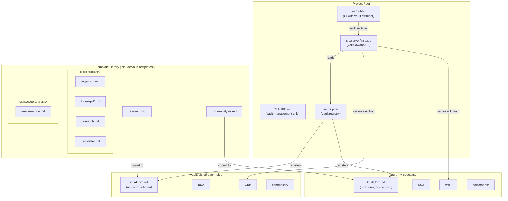

# Knowledge Compiler Rehaul -- Multi-Vault Support with Vault-Type Templates

**Document ID:** PLAN-REHAUL-001
**Version:** 1.1
**Date:** 2026-04-14
**Status:** Draft — v1.1 adds lint.md and README.md to Section 4 file changes; clarifies path field security stripping in Section 5.1

---

## Table of Contents

1. [Executive Summary](#1-executive-summary)
2. [Architecture Overview](#2-architecture-overview)
3. [Vault Types](#3-vault-types)
4. [File Changes](#4-file-changes)
5. [API Specification](#5-api-specification)
6. [UI Specification](#6-ui-specification)
7. [Vault Creation Flow](#7-vault-creation-flow)
8. [Skills Architecture](#8-skills-architecture)
9. [Implementation Phases](#9-implementation-phases)
10. [Risks and Mitigations](#10-risks-and-mitigations)

---

## 1. Executive Summary

The Knowledge Compiler is currently a single-vault application: one `wiki/` directory, one `raw/` directory, one `CLAUDE.md` schema, and one set of LLM skills. This rehaul introduces Obsidian-style "vaults" -- independent knowledge bases, each with its own directory structure, schema, and skill set. The existing wiki and raw directories at the project root become the first vault (`signal-over-noise`) with zero data migration.

The key innovation is **vault-type templates**. Each vault is created from a template that defines its page types, required sections, tagging taxonomy, workflows, and LLM skills. The initial release ships two templates: `research` (the current schema, extracted verbatim) and `code-analysis` (a new template optimized for analyzing codebases). Future templates (financial analysis, competitive intelligence, etc.) can be added by dropping a new `.md` file into the template library.

The end state is an application where a user can maintain multiple independent knowledge bases -- one for research on emerging technologies, another for analyzing a large codebase, a third for competitive landscape analysis -- all served by the same Express server and D3 graph viewer, switchable via a dropdown in the toolbar. Each vault's LLM operations are governed by its own `CLAUDE.md`, and each vault carries its own set of Claude Code skills appropriate to its type.

---

## 2. Architecture Overview

### 2.1 Vault Concept and Registry

A **vault** is an independent knowledge base comprising:
- A root directory (anywhere on the filesystem)
- `<vault-root>/raw/` -- immutable source documents
- `<vault-root>/wiki/` -- LLM-maintained wiki pages
- `<vault-root>/CLAUDE.md` -- the schema governing all LLM operations for this vault
- `<vault-root>/.claude/commands/` -- vault-type-specific skills

Vaults are registered in `vaults.json` at the project root. This file is gitignored (paths are machine-specific). A `vaults.example.json` is committed as a template.

```json
[
  {
    "id": "signal-over-noise",
    "name": "Signal Over Noise",
    "template": "research",
    "path": "/absolute/path/to/vault",
    "purpose": "LLM-maintained knowledge base on Signal Over Noise"
  }
]
```

The `id` is a kebab-case slug used as the stable identifier across API calls, localStorage keys, and URL parameters. The `template` field records which template was used to create the vault (informational; the vault's `CLAUDE.md` is the authoritative schema after creation).

### 2.2 Template Library System

Vault-type templates live in `.claude/vault-templates/`:

```
.claude/vault-templates/
  research.md            -- extracted from current CLAUDE.md
  code-analysis.md       -- new template for codebase analysis
```

Each template is a complete, standalone `CLAUDE.md` file. When a vault is created, the chosen template is copied to `<vault-root>/CLAUDE.md` and the Purpose section is customized with the user's description. Templates contain a `<!-- CUSTOMIZE: ... -->` comment in the Purpose section to guide this customization.

### 2.3 Vault-Type-Specific Skills Architecture

Skills are organized into three tiers:

1. **Universal skills** (live at project root `.claude/commands/`): `create-vault.md`, `journal.md`, `lint.md` -- these work across all vault types by reading the active vault's `CLAUDE.md` to understand page types and workflows.
2. **Vault-type-specific skills** (live in `.claude/vault-templates/skills/<template-name>/`): copied into the vault's `.claude/commands/` directory at creation time.
   - Research: `ingest-url.md`, `ingest-pdf.md`, `research.md`, `newsletter.md`
   - Code-analysis: `analyze-code.md`
3. **Vault-local skills** (live in `<vault-root>/.claude/commands/`): the actual copies that the LLM uses at runtime.

During vault creation, the `create-vault` skill copies all vault-type-specific skills plus universal skills into the vault's `.claude/commands/` directory. This ensures each vault is self-contained.

### 2.4 How the Root CLAUDE.md Changes Role

The current root `CLAUDE.md` contains the full research schema (346 lines). After the rehaul:

- The root `CLAUDE.md` becomes a **vault-management meta-document** only.
- It describes: how to create/switch vaults, where `vaults.json` is, how to read the active vault's `CLAUDE.md`, and how to discover available templates.
- It contains NO page schema, NO workflow instructions, NO tagging taxonomy.
- It says: "For all schema, workflow, and page-type instructions, read the active vault's `CLAUDE.md`."

The existing research schema is extracted verbatim into `.claude/vault-templates/research.md`.

### 2.5 Architecture Diagram



---

## 3. Vault Types

### 3.1 Research Vault (Existing)

The research vault template is an exact extraction of the current `CLAUDE.md`. Nothing changes in content; the file is relocated from the project root to `.claude/vault-templates/research.md`.

**Page types and directories:**

| Directory | Type | Required Sections |
|-----------|------|-------------------|
| `wiki/summaries/` | summary | Key Points, Relevant Concepts, Source Metadata |
| `wiki/concepts/` | concept | Definition, How It Works, Key Parameters, When To Use, Risks & Pitfalls, Related Concepts, Sources |
| `wiki/entities/` | entity | Overview, Characteristics, Common Strategies, Related Entities |
| `wiki/synthesis/` | synthesis | Comparison, Analysis, Recommendations, Pages Compared |
| `wiki/newsletters/` | newsletter | Long-form Signal Over Noise style (see newsletter skill) |
| `wiki/journal/` | journal | Setup, Process, Result, What Went Well, What Could Improve |
| `wiki/presentations/` | presentation | Marp slide decks |
| `wiki/images/` | (media) | SVG and image files |
| `wiki/index.md` | index | Master catalog |
| `wiki/log.md` | log | Append-only activity log |

**Frontmatter fields:** title, type, tags, created, updated, sources, confidence

**Workflows:** Ingest, Query, Lint, Research, Newsletter, Journal

**Skills:** ingest-url, ingest-pdf, research, newsletter, journal, lint

**Tagging taxonomy:** Customizable per domain (template includes placeholder categories)

**Confidence levels:** high, medium, low (with multi-source rules)

### 3.2 Code Analysis Vault (New)

The code-analysis template defines a schema optimized for analyzing software codebases. It replaces research-oriented page types with code-oriented ones.

**Page types and directories:**

| Directory | Type | Frontmatter Fields | Required Sections |
|-----------|------|---------------------|-------------------|
| `wiki/classes/` | class | title, type, tags, created, updated, source_files, language, confidence | Definition, Properties, Methods, Dependencies, Patterns Used, Related Classes |
| `wiki/functions/` | function | title, type, tags, created, updated, source_files, language, confidence | Signature, Purpose, Parameters, Return Value, Side Effects, Called By, Calls |
| `wiki/apis/` | api | title, type, tags, created, updated, source_files, confidence | Endpoint, Method, Auth, Request Schema, Response Schema, Error Codes, Related Endpoints |
| `wiki/libraries/` | library | title, type, tags, created, updated, version_pinned, confidence | Purpose, Version Pinned, Key APIs Used, Why Chosen, Alternatives Considered |
| `wiki/patterns/` | pattern | title, type, tags, created, updated, source_files, confidence | Intent, Structure, Where Used in Codebase, Trade-offs, Related Patterns |
| `wiki/anti-patterns/` | anti-pattern | title, type, tags, created, updated, source_files, confidence | What It Is, Where Found, Impact, Recommended Refactor |
| `wiki/modules/` | module | title, type, tags, created, updated, source_files, confidence | Responsibility, Public Exports, Internal Dependencies, External Dependencies |
| `wiki/journal/` | journal | title, type, tags, created, session_type, wiki_pages_consulted, outcome | Setup, Process, Result, What Went Well, What Could Improve |
| `wiki/index.md` | index | (none) | Master catalog |
| `wiki/log.md` | log | (none) | Append-only activity log |

**Frontmatter format:**

```yaml
---
title: "Page Title"
type: class | function | api | library | pattern | anti-pattern | module | journal
tags: [tag1, tag2, tag3]
created: YYYY-MM-DD
updated: YYYY-MM-DD
source_files: ["src/server/index.js", "src/public/js/app.js"]
language: javascript | python | typescript | java | go | rust | other
confidence: high | medium | low
---
```

**Required sections by page type:**

**Class pages** (`wiki/classes/`):
- `## Definition` -- One-paragraph description of the class's responsibility and role in the architecture
- `## Properties` -- Table of properties: name, type, visibility, description
- `## Methods` -- Table of methods: name, parameters, return type, description
- `## Dependencies` -- What this class depends on (imports, injections, inherited classes)
- `## Patterns Used` -- Links to pattern pages for patterns this class implements (singleton, observer, etc.)
- `## Related Classes` -- Wiki links to related class pages

**Function pages** (`wiki/functions/`):
- `## Signature` -- Full function signature with types
- `## Purpose` -- One-paragraph description of what this function does and why
- `## Parameters` -- Table: name, type, default, description
- `## Return Value` -- Type and description of the return value
- `## Side Effects` -- Any state mutations, I/O, or other side effects
- `## Called By` -- Links to function/class pages that call this function
- `## Calls` -- Links to function pages this function calls

**API endpoint pages** (`wiki/apis/`):
- `## Endpoint` -- Full URL path (e.g., `GET /api/wiki/files`)
- `## Method` -- HTTP method (GET, POST, PUT, DELETE, PATCH)
- `## Auth` -- Authentication requirements (none, API key, JWT, etc.)
- `## Request Schema` -- Request body/query parameter schema (JSON or table)
- `## Response Schema` -- Response body schema with example
- `## Error Codes` -- Table: HTTP status, error code, description
- `## Related Endpoints` -- Links to related API pages

**Library pages** (`wiki/libraries/`):
- `## Purpose` -- Why this library is in the project
- `## Version Pinned` -- Current version and whether it is pinned
- `## Key APIs Used` -- Which APIs/functions from this library the project actually uses
- `## Why Chosen` -- Decision rationale for selecting this library
- `## Alternatives Considered` -- Other libraries evaluated and why they were rejected

**Pattern pages** (`wiki/patterns/`):
- `## Intent` -- What problem this pattern solves
- `## Structure` -- Mermaid class diagram or description of the pattern's structure
- `## Where Used in Codebase` -- File:line references to concrete implementations
- `## Trade-offs` -- Benefits and drawbacks in this codebase's context
- `## Related Patterns` -- Links to related pattern pages

**Anti-pattern pages** (`wiki/anti-patterns/`):
- `## What It Is` -- Description of the anti-pattern and why it is problematic
- `## Where Found` -- File:line references to instances in the codebase
- `## Impact` -- Concrete consequences (performance, maintainability, correctness)
- `## Recommended Refactor` -- How to fix each instance, with code sketch if helpful

**Module pages** (`wiki/modules/`):
- `## Responsibility` -- Single-paragraph description of what this module owns
- `## Public Exports` -- Table of exported symbols: name, type, description
- `## Internal Dependencies` -- Links to other module pages this module imports from
- `## External Dependencies` -- Links to library pages for third-party dependencies

**Code-analysis workflows:**

**Analyze** -- When the user says "analyze <file-or-directory>":
1. Read the source file(s) completely
2. Identify all classes, functions, API endpoints, and patterns
3. For each identified element: create the page if it doesn't exist, or update it with new information
4. For any libraries imported, create or update library pages
5. Identify patterns and anti-patterns; create or update those pages
6. Add cross-links in both directions between all touched pages
7. Update `wiki/index.md` and `wiki/log.md`
8. Invoke the journal skill

**Analyze Dependencies** -- When the user says "analyze-deps":
1. Read dependency files (package.json, requirements.txt, Cargo.toml, go.mod, etc.)
2. For each dependency: create or update a library page
3. Update `wiki/index.md` and `wiki/log.md`

**Query** -- Same as research vault (reasons over existing wiki)

**Lint** (adapted) -- Checks for: orphan pages, missing cross-links, stale function signatures (source_files reference files that have changed), broken file:line references, incomplete sections, modules without dependency links

**Journal** (adapted) -- Same structure but session_type includes `analyze` and page type lists reference code-analysis types

**Tagging taxonomy for code-analysis:**

- **Language**: `javascript`, `python`, `typescript`, `java`, `go`, `rust`
- **Layer**: `frontend`, `backend`, `database`, `infrastructure`, `testing`
- **Concern**: `routing`, `authentication`, `state-management`, `rendering`, `data-access`, `configuration`
- **Quality**: `well-structured`, `needs-refactor`, `technical-debt`
- **Status**: `stable`, `in-development`, `deprecated`

**Confidence levels for code-analysis:**

- **high** -- Source code directly read and analyzed; multiple cross-references confirm the structure
- **medium** -- Inferred from partial reading or single file; may be missing context from unread files
- **low** -- Based on naming conventions or comments alone; source not fully analyzed

### 3.3 Template Extensibility

To add a future vault type (e.g., `financial-analysis`):

1. Create `.claude/vault-templates/financial-analysis.md` containing the complete CLAUDE.md schema for that vault type (Purpose with `<!-- CUSTOMIZE -->` placeholder, Directory Layout, File Naming, Page Format, Required Sections by Page Type, Linking Conventions, Tagging Taxonomy, Confidence Levels, Workflows, Rules)
2. Create `.claude/vault-templates/skills/financial-analysis/` containing any vault-type-specific skills
3. Register the template name in the `create-vault` skill's template list

**What a template must contain:**

Every template must include these sections (matching the structure of the existing research template):

| Section | Purpose |
|---------|---------|
| Purpose | Describes the knowledge domain; contains `<!-- CUSTOMIZE -->` comment |
| Directory Layout | Lists all directories under `wiki/` with their purpose |
| File Naming | Naming conventions (lowercase, hyphens, etc.) |
| Page Format | Frontmatter schema with all fields |
| Required Sections by Page Type | For each page type, the mandatory H2 sections |
| Linking Conventions | How pages link to each other |
| Tagging Taxonomy | Domain-specific tag categories |
| Confidence Levels | Definitions of high/medium/low |
| Workflows | What the LLM does for each command (ingest, query, lint, etc.) |
| Rules | Invariants the LLM must always follow |

---

## 4. File Changes

### 4.1 Modified Files

#### `CLAUDE.md` (project root)
- **Type:** Modified
- **Change:** Replace entire content with a vault-management meta-document. Remove all page schema, workflow instructions, tagging taxonomy, and confidence definitions. Replace with: vault concept explanation, pointer to `vaults.json`, instructions to read active vault's `CLAUDE.md` for all schema and workflow instructions, list of available templates, and instructions for the `create-vault` skill.
- **Size:** ~50 lines (down from ~346)

#### `src/server/index.js`
- **Type:** Modified
- **Changes:**
  1. Add `vaults.json` loading at startup (with fallback to legacy single-vault mode)
  2. Add vault resolution helper: reads `?vault=<id>` query parameter, looks up path in registry, falls back to first vault or legacy `wiki/` directory
  3. Modify `GET /api/wiki/files` to accept `?vault=<id>` and serve files from the resolved vault's `wiki/` directory
  4. Modify `GET /api/wiki/file` to accept `?vault=<id>` and resolve file paths within the vault's `wiki/` directory
  5. Modify `GET /api/wiki/image` to accept `?vault=<id>` and resolve image paths within the vault's `wiki/images/` directory
  6. Modify `POST /api/raw/upload` to accept `?vault=<id>` and upload to the vault's `raw/` directory
  7. Add `GET /api/vaults` endpoint returning the vault registry
  8. Add path-traversal prevention for vault-resolved paths (must stay within vault root)

#### `src/public/index.html`
- **Type:** Modified
- **Changes:**
  1. Add vault selector `<select>` element in the toolbar-left section, after the app title
  2. Add a vault name display element showing the active vault's name

#### `src/public/js/app.js`
- **Type:** Modified
- **Changes:**
  1. On startup, fetch `/api/vaults` to get vault list
  2. Populate vault selector dropdown
  3. Read active vault from `localStorage` key `kc-active-vault`; validate it exists in vault list; fall back to first vault
  4. Pass active vault ID to `GraphBuilder.build()` and all API calls
  5. On vault switch: save to localStorage, rebuild graph, reset navigation, update title
  6. If no vaults exist (empty or missing `vaults.json`), hide vault selector and behave as legacy mode (use root `wiki/`)

#### `src/public/js/graph.js`
- **Type:** Modified
- **Changes:**
  1. `GraphBuilder.build()` accepts an optional `vaultId` parameter
  2. All fetch calls to `/api/wiki/files` and `/api/wiki/file` append `?vault=<vaultId>` when provided

#### `src/public/js/content.js`
- **Type:** Modified
- **Changes:**
  1. Image path resolution hook prepends `?vault=<vaultId>` to `/api/wiki/image` calls
  2. `ContentRenderer.init()` accepts an optional `vaultId` parameter and stores it for use in image resolution

#### `src/public/js/utils.js`
- **Type:** Modified
- **Changes:**
  1. Add new type colours for code-analysis page types: `class: '#2ECC71'`, `function: '#3498DB'`, `api: '#E67E22'`, `library: '#1ABC9C'`, `pattern: '#8E44AD'`, `anti-pattern: '#E74C3C'`, `module: '#F39C12'`
  2. Add corresponding label colours (all `#fff` since these are all dark enough)
  3. Update `inferType()` to handle new directory names (classes, functions, apis, libraries, patterns, anti-patterns, modules)

#### `src/public/css/styles.css`
- **Type:** Modified
- **Changes:**
  1. Add styles for `.vault-selector` (select element in toolbar)
  2. Add styles for `.vault-name` (active vault name display)

#### `.gitignore`
- **Type:** Modified
- **Changes:**
  1. Add `vaults.json` to gitignore

### 4.2 New Files

#### `vaults.example.json`
- **Type:** New
- **Path:** Project root
- **Content:** Example vault registry showing the schema:
```json
[
  {
    "id": "signal-over-noise",
    "name": "Signal Over Noise",
    "template": "research",
    "path": "/absolute/path/to/knowledge-compiler",
    "purpose": "LLM-maintained knowledge base on Signal Over Noise"
  }
]
```

#### `.claude/vault-templates/research.md`
- **Type:** New
- **Content:** Exact copy of the current `CLAUDE.md` (all 346 lines). This IS the current schema, relocated. The `<!-- CUSTOMIZE -->` comments already exist in the Purpose and Tagging Taxonomy sections.

#### `.claude/vault-templates/code-analysis.md`
- **Type:** New
- **Content:** Complete CLAUDE.md for code-analysis vaults. Full schema as described in Section 3.2 above. Includes: Purpose (with `<!-- CUSTOMIZE -->`), Directory Layout (classes, functions, apis, libraries, patterns, anti-patterns, modules, journal, images, index, log), File Naming conventions, Page Format (frontmatter with source_files and language fields), Required Sections by Page Type (all 7 code page types plus journal), Linking Conventions, Tagging Taxonomy (Language, Layer, Concern, Quality, Status), Confidence Levels (code-analysis specific), Workflows (Analyze, Analyze Dependencies, Query, Lint, Journal), Rules.

#### `.claude/vault-templates/skills/research/ingest-url.md`
- **Type:** New
- **Content:** Copy of current `.claude/commands/ingest-url.md` (unchanged)

#### `.claude/vault-templates/skills/research/ingest-pdf.md`
- **Type:** New
- **Content:** Copy of current `.claude/commands/ingest-pdf.md` (unchanged)

#### `.claude/vault-templates/skills/research/research.md`
- **Type:** New
- **Content:** Copy of current `.claude/commands/research.md` (unchanged)

#### `.claude/vault-templates/skills/research/newsletter.md`
- **Type:** New
- **Content:** Copy of current `.claude/commands/newsletter.md` (unchanged)

#### `.claude/vault-templates/skills/code-analysis/analyze-code.md`
- **Type:** New
- **Content:** Skill that reads source code files, identifies classes/functions/APIs/patterns, and creates/updates wiki pages. Analogous to `ingest-url` for research vaults. Arguments: file or directory path. Steps: (1) verify path exists, (2) read all source files, (3) for each file identify classes/functions/APIs, (4) create/update wiki pages with full required sections, (5) identify patterns and anti-patterns, (6) cross-link all touched pages, (7) update index and log, (8) invoke journal skill. Allowed tools: Read, Write, Edit, Glob, Bash.

#### `.claude/commands/create-vault.md`
- **Type:** New
- **Content:** Universal skill for creating new vaults. Arguments: name, path, template, purpose. Steps detailed in Section 7.

#### `.claude/commands/journal.md` (updated universal version)
- **Type:** Modified
- **Content:** Updated to read the active vault's `CLAUDE.md` to discover page types, so it generates appropriate `wiki_pages_consulted` lists regardless of whether the vault is research or code-analysis type. The fundamental structure (Setup, Process, Result, What Went Well, What Could Improve) remains unchanged.

#### `.claude/commands/lint.md` (new universal skill)
- **Type:** New
- **Content:** Universal lint/health-check skill. Reads active vault's `CLAUDE.md` to determine vault type, then runs vault-type-appropriate checks. Research: orphan pages, stale claims, contradictions, missing cross-links, incomplete sections. Code-analysis: stale `source_files` references, broken file:line references, modules without dependency links. Auto-fixes where possible. Appends to `wiki/log.md`. Invokes journal skill.

#### `README.md`
- **Type:** Modified
- **Changes:**
  1. Add "Vaults" section explaining the multi-vault concept
  2. Document `vaults.json` setup (copy from `vaults.example.json`, edit absolute paths)
  3. Document available templates (research, code-analysis) with brief descriptions
  4. Document the `create-vault` skill and its interactive flow
  5. Document the vault selector UI (dropdown in toolbar)
  6. Update "Getting Started" to mention vault setup as a prerequisite step

---

## 5. API Specification

### 5.1 New Endpoints

#### `GET /api/vaults`
Returns the vault registry.

**Request:** No parameters.

**Response (200):**
```json
[
  {
    "id": "signal-over-noise",
    "name": "Signal Over Noise",
    "template": "research",
    "purpose": "LLM-maintained knowledge base on Signal Over Noise"
  }
]
```

> **Security note:** The `path` field is present in `vaults.json` but **must be stripped from the API response** — the client has no need for filesystem paths and exposing them is an unnecessary information leak. The server reads `path` internally for vault resolution; it never appears in any API response body.

**Response (200, no vaults.json or empty):**
```json
[]
```

**Error handling:** If `vaults.json` is missing or malformed, return `[]` and log a warning to the server console.

### 5.2 Modified Endpoints

All existing endpoints gain an optional `?vault=<id>` query parameter.

#### `GET /api/wiki/files?vault=<id>`
- **Vault resolution:** Look up `id` in `vaults.json`, use `path` field + `/wiki/` as the root directory.
- **Fallback (no vault param):** If `?vault` is absent, use the first vault in the registry. If registry is empty, fall back to the legacy `WIKI_DIR` (two levels up from `src/server/`).
- **Error (unknown vault):** Return `404 { error: "Unknown vault: <id>" }`.

#### `GET /api/wiki/file?path=<path>&vault=<id>`
- Same vault resolution as above.
- Path-traversal prevention remains: resolved path must start with the vault's `wiki/` directory.

#### `GET /api/wiki/image?path=<path>&vault=<id>`
- Same vault resolution.
- Resolved path must start with the vault's `wiki/images/` directory.

#### `POST /api/raw/upload?vault=<id>`
- Same vault resolution, writing to the vault's `raw/` directory.
- All existing validation (filename sanitization, conflict prevention) applies.

### 5.3 Vault Resolution Logic (Server-Side Helper)

```
function resolveVault(vaultId):
  registry = loadVaultsJson()     // cached, reloaded on change
  if vaultId:
    vault = registry.find(v => v.id === vaultId)
    if !vault: throw 404 "Unknown vault"
    return vault.path
  if registry.length > 0:
    return registry[0].path       // default to first vault
  return LEGACY_ROOT              // fallback to project root
```

The wiki directory is `resolveVault(id) + '/wiki/'` and the raw directory is `resolveVault(id) + '/raw/'`.

---

## 6. UI Specification

### 6.1 Vault Selector

**Location:** Toolbar left section, immediately after the "Knowledge Compiler" title.

**HTML structure:**
```html
<div class="vault-selector-container">
  <select id="vault-select" class="vault-selector" title="Switch vault">
    <option value="signal-over-noise">Signal Over Noise</option>
    <option value="my-codebase">My Codebase</option>
  </select>
</div>
```

**CSS class:** `.vault-selector`
- Background: `rgba(255,255,255,0.12)` (matches toolbar buttons)
- Color: `#fff`
- Border: `1px solid rgba(255,255,255,0.2)`
- Border-radius: `4px`
- Padding: `4px 8px`
- Font-size: `13px`
- Cursor: `pointer`
- Max-width: `200px`
- Text-overflow: `ellipsis`

**CSS class:** `.vault-selector-container`
- Margin-left: `12px`
- Flex: `0 0 auto`

### 6.2 Behavior on Vault Switch

When the user selects a different vault from the dropdown:

1. Save new vault ID to `localStorage` key `kc-active-vault`
2. Show a toast: "Switching to [Vault Name]..."
3. Call `GraphBuilder.build(newVaultId)` to rebuild the graph
4. Destroy and reinitialize Visualization, ContentRenderer, Navigation, Search
5. Navigate to `index.md` in the new vault
6. Show a success toast: "Switched to [Vault Name] -- N nodes, M edges"

### 6.3 Edge Cases

- **No vaults.json or empty:** Hide the vault selector entirely. Application behaves exactly as it does today (reads from root `wiki/`). No visual change.
- **Active vault removed from registry:** On startup, if localStorage vault ID is not in the registry, fall back to first vault. Show a warning toast: "Vault '[id]' no longer registered. Switched to [first vault name]."
- **Vault directory missing:** If the resolved vault path doesn't exist or has no `wiki/` subdirectory, the existing empty-wiki handling (NFR-REL-001) kicks in: show "No wiki files found" message.
- **Single vault:** Vault selector is visible but has only one option. User can still see the vault name.

### 6.4 Title Update

When a vault is active, the browser tab title updates to: `Knowledge Compiler -- [Vault Name]`.

---

## 7. Vault Creation Flow

### 7.1 User Interaction

The user invokes the `create-vault` skill in Claude Code:

```
/create-vault
```

Or directly:
```
Create a new vault for analyzing the FastAPI codebase
```

### 7.2 Skill Steps

The `create-vault` skill (`/.claude/commands/create-vault.md`) performs:

**Step 1 -- Gather parameters:**
Ask the user for:
- **Name**: Display name for the vault (e.g., "FastAPI Analysis")
- **Location**: Absolute directory path for the vault root (e.g., `/Users/me/vaults/fastapi-analysis`)
- **Purpose**: One-paragraph description of the vault's domain
- **Template**: List available templates from `.claude/vault-templates/` (excluding `skills/` subdirectory) and ask user to pick one

**Step 2 -- Derive vault ID:**
- Lowercase the name, replace spaces and non-alphanumeric characters with hyphens, remove leading/trailing hyphens
- Example: "FastAPI Analysis" -> `fastapi-analysis`

**Step 3 -- Validate:**
- Check that the directory path doesn't already contain a `CLAUDE.md` (prevent overwriting an existing vault)
- Check that the vault ID doesn't already exist in `vaults.json`

**Step 4 -- Create directory structure:**
```
<vault-root>/
  raw/
  wiki/
    classes/       (code-analysis only)
    functions/     (code-analysis only)
    apis/          (code-analysis only)
    libraries/     (code-analysis only)
    patterns/      (code-analysis only)
    anti-patterns/ (code-analysis only)
    modules/       (code-analysis only)
    concepts/      (research only)
    entities/      (research only)
    summaries/     (research only)
    synthesis/     (research only)
    newsletters/   (research only)
    journal/
    images/
    presentations/ (research only)
    index.md
    log.md
  .claude/
    commands/
  CLAUDE.md
```

The directories created depend on the chosen template's Directory Layout section.

**Step 5 -- Copy and customize CLAUDE.md:**
- Copy `.claude/vault-templates/<template>.md` to `<vault-root>/CLAUDE.md`
- Replace the Purpose section's `<!-- CUSTOMIZE -->` placeholder with the user's purpose description

**Step 6 -- Copy skills:**
- Copy all files from `.claude/vault-templates/skills/<template>/` to `<vault-root>/.claude/commands/`
- Copy universal skills (`journal.md`, `lint.md`) from `.claude/commands/` to `<vault-root>/.claude/commands/` (or note that these are at the project root level)

**Step 7 -- Create template wiki files:**

`wiki/index.md`:
```markdown
---
title: "Index"
type: index
created: YYYY-MM-DD
updated: YYYY-MM-DD
---

# [Vault Name] -- Master Catalog

## Statistics
- Total pages: 0

## [Page Type 1]
| Page | Created | Confidence |
|------|---------|------------|

## [Page Type 2]
...

## Journals
| Page | Session Type | Created | Outcome |
|------|--------------|---------|---------|
```

The page type sections depend on the template.

`wiki/log.md`:
```markdown
---
title: "Activity Log"
type: log
created: YYYY-MM-DD
---

# Activity Log

### YYYY-MM-DD -- Vault Created

- **Template**: <template-name>
- **Purpose**: <purpose>
```

**Step 8 -- Register in vaults.json:**
- Read `vaults.json` from project root (create if missing)
- Append the new vault entry
- Write back to `vaults.json`

**Step 9 -- Report:**
Tell the user:
- Vault created at `<path>`
- Template used: `<template>`
- How to switch to it: select it from the vault dropdown in the UI, or refresh the page
- Vault ID for API use: `<id>`

---

## 8. Skills Architecture

### 8.1 Universal Skills (Project Root)

These skills live at `.claude/commands/` at the project root and work with any vault type:

| Skill | File | Purpose |
|-------|------|---------|
| `create-vault` | `.claude/commands/create-vault.md` | Create a new vault from a template |
| `journal` | `.claude/commands/journal.md` | Capture session notes (reads vault CLAUDE.md for page types) |

Note: `lint` is currently not a separate skill file but a workflow in CLAUDE.md. It could be extracted as a universal skill that reads the vault's CLAUDE.md to understand what to check.

### 8.2 Vault-Type-Specific Skills

**Research vault skills** (`.claude/vault-templates/skills/research/`):

| Skill | Purpose |
|-------|---------|
| `ingest-url.md` | Fetch URL, convert to markdown, save to raw/ |
| `ingest-pdf.md` | Parse PDF to markdown, save to raw/ |
| `research.md` | Web research on a topic, save research log |
| `newsletter.md` | Generate long-form newsletter from wiki content |

**Code-analysis vault skills** (`.claude/vault-templates/skills/code-analysis/`):

| Skill | Purpose |
|-------|---------|
| `analyze-code.md` | Read source code, create/update wiki pages for all elements found |

### 8.3 Skill Discovery by the LLM

The LLM discovers which skills apply through two mechanisms:

1. **Project-level skills**: Claude Code automatically discovers skills in `.claude/commands/` at the project root. These are always available.
2. **Vault-level skills**: When the `create-vault` skill copies skills into `<vault-root>/.claude/commands/`, those skills become available when the user is working within that vault's context. The root `CLAUDE.md` instructs the LLM: "Read the active vault's `CLAUDE.md` for workflow instructions. The vault's skills are in `<vault-root>/.claude/commands/`."

The current implementation of Claude Code skill discovery looks at `.claude/commands/` in the project root. For vault-level skills to be discoverable, the LLM must either:
- Be explicitly told to look at the vault's `.claude/commands/` directory (via the root CLAUDE.md instructions)
- Or the vault-specific skills can be symlinked or referenced from the project root

The practical approach: the root `CLAUDE.md` includes explicit instructions like "When operating on vault [id], also check `<vault-path>/.claude/commands/` for vault-specific skills." The LLM reads these instructions and uses `Glob` to discover skills in the vault directory.

---

## 9. Implementation Phases

### Phase 1: Template Extraction and Vault Registry (Non-Breaking)

**Goal:** Extract the current CLAUDE.md into a template, create the vault registry, and add the `vaults.example.json` file. No behavior changes -- app continues to work exactly as before.

1. Create `.claude/vault-templates/research.md` (copy of current CLAUDE.md)
2. Create `.claude/vault-templates/code-analysis.md` (new template)
3. Create `vaults.example.json` at project root
4. Add `vaults.json` to `.gitignore`
5. Create `.claude/vault-templates/skills/research/` and copy existing skill files
6. Create `.claude/vault-templates/skills/code-analysis/analyze-code.md`
7. Create `.claude/commands/create-vault.md`

**Validation:** App works identically. No server or UI changes. All existing skills still work.

### Phase 2: Server-Side Vault Awareness

**Goal:** Make the Express server vault-aware. All existing API calls without `?vault=` continue to work unchanged.

1. Add vault registry loading to `src/server/index.js`
2. Add vault resolution helper function
3. Add `GET /api/vaults` endpoint
4. Modify all existing endpoints to accept `?vault=<id>` parameter
5. Add path-traversal prevention for vault-resolved paths

**Validation:** Existing UI works without changes. `GET /api/vaults` returns `[]` when no `vaults.json` exists. All existing endpoints return same data as before when called without `?vault=`.

### Phase 3: UI Vault Switcher

**Goal:** Add the vault selector dropdown and vault switching logic to the frontend.

1. Add vault selector HTML to `index.html`
2. Add vault selector CSS to `styles.css`
3. Update `app.js` to fetch vaults, populate selector, handle switching
4. Update `graph.js` to pass vault ID to API calls
5. Update `content.js` to pass vault ID to image API calls
6. Update `utils.js` with new type colours for code-analysis page types

**Validation:** With no `vaults.json`, app behaves as before (selector hidden). With a `vaults.json` pointing to root as a vault, app works identically but shows vault selector. Switching between vaults rebuilds the graph correctly.

### Phase 4: Root CLAUDE.md Transformation

**Goal:** Convert the root CLAUDE.md to the vault-management meta-document. This is done last because it changes LLM behavior.

1. Rewrite root `CLAUDE.md` to vault-management meta-document
2. Update universal skills (journal.md) to be vault-type-aware
3. Create initial `vaults.json` registering the existing wiki as `signal-over-noise`

**Validation:** LLM operations still work when pointed at the signal-over-noise vault. Create-vault skill successfully creates a new vault.

### Phase 5: Testing and Polish

**Goal:** End-to-end validation and edge case handling.

1. Test vault creation flow end-to-end
2. Test vault switching in UI
3. Test legacy mode (no vaults.json)
4. Test error cases (missing vault directory, unknown vault ID)
5. Verify code-analysis template completeness

---

## 10. Risks and Mitigations

### Risk 1: Skill Discovery for Vault-Specific Skills

**Risk:** Claude Code's skill discovery mechanism looks at `.claude/commands/` in the project root. Vault-specific skills in `<vault-root>/.claude/commands/` may not be automatically discovered.

**Mitigation:** The root `CLAUDE.md` explicitly instructs the LLM to check the active vault's `.claude/commands/` directory. The LLM can use `Glob` to discover and `Read` to load vault-specific skills at runtime. This is a convention-based approach, not a framework-enforced one.

### Risk 2: Breaking Existing Behavior

**Risk:** Changes to the server API or CLAUDE.md could break existing workflows.

**Mitigation:** Phase 1 makes no server or UI changes. Phase 2 is backward compatible (no `?vault=` parameter = legacy behavior). Phase 4 (CLAUDE.md rewrite) is done last. At every phase, the app is in a working state.

### Risk 3: vaults.json Corruption

**Risk:** A malformed `vaults.json` could prevent the app from loading.

**Mitigation:** The server treats `vaults.json` as optional. If missing or malformed, it returns `[]` from `/api/vaults` and falls back to legacy mode. The frontend hides the vault selector when the list is empty.

### Risk 4: Path Traversal with Vault Paths

**Risk:** A malicious or misconfigured vault path in `vaults.json` could allow serving files from arbitrary filesystem locations.

**Mitigation:** The server validates that resolved file paths stay within the vault's root directory. The existing path-traversal prevention pattern (checking `resolved.startsWith(baseDir)`) is applied to vault-resolved paths.

### Risk 5: Code-Analysis Template Completeness

**Risk:** The code-analysis template is new and untested. It may have gaps in its schema or workflows.

**Mitigation:** The template is designed to be iterable. After initial implementation, real-world usage on a codebase will reveal gaps, which can be addressed by updating the template file. Vaults created from a template are independent -- updating the template doesn't retroactively change existing vaults.

### Risk 6: Large Vaults on Different Filesystems

**Risk:** Vault paths on network drives or removable media may have latency issues.

**Mitigation:** No special handling needed -- the same file I/O patterns used for the local wiki directory apply. Performance is bounded by the filesystem, not the application. Document this as a known limitation.

---
