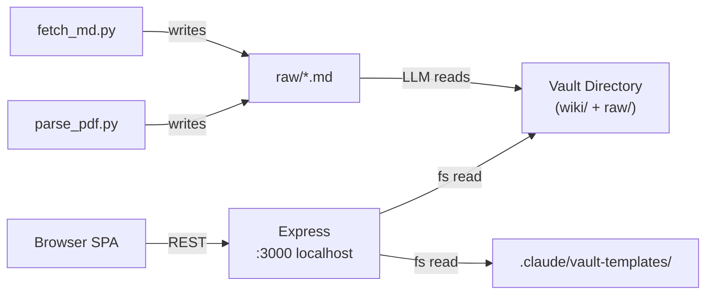
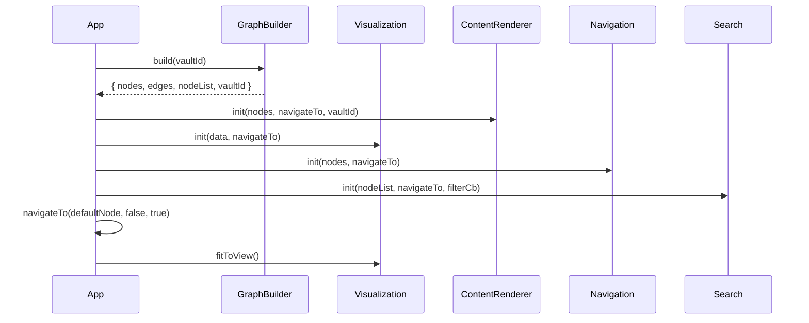
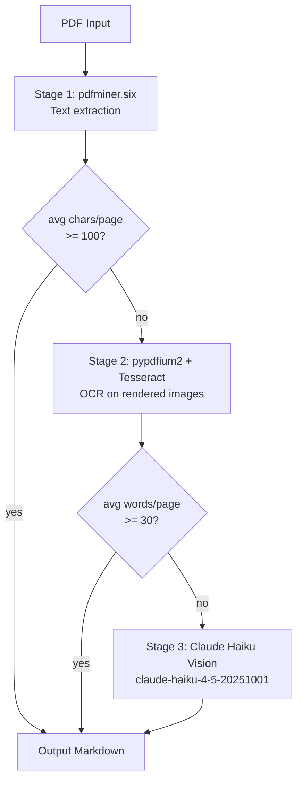

# Technical Deep Dive: knowledge-compiler

## 1. Architecture Overview

**knowledge-compiler** is a local-first, LLM-maintained wiki visualisation system. The core idea is simple: you point it at a directory of Markdown files, and it gives you an interactive force-directed graph where every node is a wiki page and every edge is a link between pages. Click a node and the right panel renders the Markdown. That's it — no cloud, no accounts, no syncing.

The stack is deliberately minimal. The server is a thin Express process (`src/server/index.js`) that serves two things: a static SPA from `src/public/`, and a handful of REST endpoints that expose the local filesystem. The frontend is six hand-rolled JavaScript modules loaded via `<script>` tags — no bundler, no framework, no build step. The Python ingestion tools (`parse_pdf.py`, `fetch_md.py`) are standalone CLIs that drop Markdown files into the vault's `raw/` directory.

> **Key Insight:** The entire design bets on local-first simplicity. By binding the server to `127.0.0.1:3000` exclusively and treating the filesystem as the database, the project avoids auth, cloud sync, and deployment concerns entirely. The trade-off is that it only works on your own machine.

| Layer | Technology | Role |
| --- | --- | --- |
| HTTP server | Express 4.21 | REST API + static file serving |
| Frontend | Vanilla JS (IIFE modules) | Graph + content rendering |
| Graph rendering | D3.js v7.9 | Force-directed simulation |
| Markdown parsing | marked 15 | Wiki page rendering |
| HTML sanitisation | DOMPurify 3.3 | XSS prevention |
| Diagram rendering | Mermaid | Inline SVG diagrams |
| PDF ingestion | Python (pdfminer.six + Tesseract + Claude) | Three-stage text extraction |
| URL ingestion | Python (BeautifulSoup + markdownify) | Web-to-Markdown conversion |



## 2. Core Data Model

Everything in the frontend revolves around the **graph data object** produced by `GraphBuilder.build()`. Think of it as the in-memory database — every module receives it at init time and never fetches data independently.

The graph object has four fields: `nodes` (a `Map<string, Node>` keyed by file path), `edges` (an `Array<{source, target}>`), `nodeList` (a flat `Array<Node>` for search), and `vaultId` (the active vault identifier). The `nodes` Map is the authoritative lookup; `nodeList` is a denormalized copy for algorithms that need a plain array.

Each **Node** carries everything downstream modules need:

```javascript
// Produced by src/public/js/graph.js — build()
{
  id: "wiki/modules/app.md",   // stable key — wiki-root-relative path
  displayName: "App",          // from frontmatter title, or slug fallback
  type: "module",              // inferred from path or frontmatter (18 possible types)
  tags: ["javascript", "frontend"],
  confidence: "high",
  created: "2026-04-14",
  updated: "2026-04-14",
  body: "# App\n\n...",        // Markdown body after YAML frontmatter stripped
  rawContent: "---\ntitle:...",// full file content (used by ContentRenderer)
  error: false,                // true if the file could not be fetched
  inbound: 4,                  // count of pages that link to this one
  outbound: 6,                 // count of internal links from this page
  colour: "#6366f1"            // hex from TYPE_COLOURS map in utils.js
}
```

> **Why file path as ID?** Using the wiki-root-relative path (`wiki/modules/app.md`) as the node ID makes link resolution trivial: extract the `href` from a Markdown link, resolve it relative to the linking file's path, and you have the node ID directly. No secondary lookup table needed.

The **type system** is enforced by `inferType()` in `utils.js`. It runs a priority chain: explicit `type` frontmatter field wins, then path-segment inference (a file in `wiki/modules/` is type `module`, in `wiki/classes/` is type `class`, etc.), then a final fallback to `"other"`. The type determines the node colour in the graph and the badge displayed in the content panel's metadata bar.

## 3. The Graph Engine Deep Dive

### Building the Graph

`GraphBuilder.build(vaultId)` is the graph construction pipeline. It runs in three phases:

**Phase 1 — Discovery:** Fetches `GET /api/wiki/files` to get a flat list of all `.md` file paths in the vault's `wiki/` directory.

**Phase 2 — Parallel fetch:** Calls `GET /api/wiki/file` for each path simultaneously using `Promise.all()`. This is the critical performance decision — on a wiki with 57 pages, sequential fetching would be 57 round-trips; parallel fetching collapses them into a single wait. Failures per file set `node.error = true` rather than aborting the entire build.

**Phase 3 — Link extraction and edge deduplication:** For each node's Markdown body, `extractLinks()` finds all `[text](path.md)` patterns with a single regex. Extracted relative paths are resolved to canonical node IDs via `resolveLink()`, checked against the nodes Map (broken links are silently dropped), and added to an edge Set (deduplicates bidirectional or duplicate references). Finally, in/out degree counts are tallied on every node.

```javascript
// src/public/js/graph.js — extractLinks()
function extractLinks(body) {
  const pattern = /\[([^\]]+)\]\(([^)]+\.md[^)]*)\)/g;
  const links = [];
  for (const match of body.matchAll(pattern)) {
    const href = match[2].split('#')[0].trim(); // strip anchors
    if (!href.startsWith('http') && href.endsWith('.md')) {
      links.push(href);
    }
  }
  return links;
}
```

> **Gotcha:** The link extractor is purely regex-based. Markdown links inside fenced code blocks or HTML comments are also extracted. If a wiki page documents a link pattern as an example, it may create phantom edges in the graph. This is a known approximation.

### Rendering the Graph

`Visualization.init(data, onNodeClick)` is the most complex module in the codebase. It sets up a D3 force simulation with four forces (link spring at 80 px, charge repulsion at −200, collision at 12 px, centre gravity), then does something clever before the first paint.

**The Pre-Tick Optimization:** Immediately after creating the simulation, the code calls `.stop()` and then `.tick()` the full mathematical number of steps synchronously in a tight loop. By the time the browser gets a frame to paint, every node already has a stable `(x, y)` position. The user sees the graph fully laid out rather than watching it settle from a chaotic initial state over several seconds.

```javascript
// src/public/js/visualization.js — init()
simulation.stop();
const n = Math.ceil(Math.log(simulation.alphaMin()) / Math.log(1 - simulation.alphaDecay()));
for (let i = 0; i < n; i++) simulation.tick();
// positions are now stable — restart with tiny alpha for micro-adjustment
simulation.alpha(0.05).restart();
```

> **Key Insight:** This is a "burn CPU upfront" trade-off. Pre-ticking 300 steps synchronously on the main thread would block for a perceptible moment on very large graphs. For typical wiki sizes (10–200 nodes) the delay is imperceptible and the UX benefit — no settling animation — is significant.

The SVG is structured in four ordered layers: edges at the bottom, then nodes, then labels, all wrapped in a `graph-root` group that receives zoom/pan transforms. This ordering matters: D3's data binding operates on selections within each layer independently, and having edges below nodes means link lines never render on top of node circles.

The active node is highlighted by scaling its circle to 1.3× and dimming all others to 30% opacity. Type-based filtering via `applyFilter(hiddenTypes)` hides node circles, their labels, and all edges connected to them, then reheats the simulation (alpha 0.3) so the remaining nodes spread out naturally.

## 4. The Content Rendering Pipeline

Every time the user navigates to a node, `ContentRenderer.render(nodeId)` runs a five-step pipeline that transforms raw Markdown into safe, interactive HTML.

```
node.body (Markdown)
  → marked.parse()          — Markdown to HTML (Mermaid fences intercepted)
  → DOMPurify.sanitize()    — XSS stripping; image src rewriting hook
  → DOM injection           — content panel updated
  → processLinks()          — .md hrefs converted to navigateTo() callbacks
  → mermaid.run()           — .mermaid divs rendered as inline SVG
```

**Mermaid's integration is the trickiest part.** Mermaid diagrams (```` ```mermaid```` blocks) must survive two processing steps that would otherwise destroy them: marked converts the fenced block to HTML, and DOMPurify would then strip Mermaid's bracket syntax as potentially dangerous attribute content. The solution is a custom marked extension that intercepts mermaid fences *before* HTML generation and wraps their content in `<div class="mermaid">` with all `<`, `>`, and `&` characters HTML-entity-encoded. DOMPurify sees harmless text content and passes it through. After DOM injection, `mermaid.run()` selects `.mermaid` elements, decodes the entities, and renders inline SVG.

A fallback also handles `<pre><code class="language-mermaid">` elements produced by marked when the custom extension's tokenizer fails to match — ensuring diagrams render even in edge cases.

**Image rewriting** is handled by a DOMPurify `afterSanitizeAttributes` hook. When DOMPurify processes an `` element, the hook intercepts the `src` attribute. Relative paths are resolved to wiki-root-relative form using `resolveLink()` from Utils, then rewritten to `/api/wiki/image?path=<encoded>&vault=<id>`. This proxy approach means images in wiki pages are served securely through the Express server's path-traversal guard rather than directly by the browser.

> **Tip:** The DOMPurify allowlist is carefully scoped. It allows `div` (needed for Mermaid containers), `img` (with the rewrite hook), and all standard text formatting tags, but explicitly blocks `script`, `style`, `iframe`, `form`, and all event handler attributes. This means untrusted wiki content — e.g., from a web-ingested page — cannot execute JavaScript even if it contains inline event handlers.

## 5. How It All Connects — `navigateTo` as the System Spine

The most important function in the entire frontend is `navigateTo(nodeId, skipRecord, skipCentre)`. Every navigation event in the application — clicking a node in the graph, selecting a search result, clicking a link in the content panel, pressing the back button, using keyboard shortcuts — flows through this single function.

```javascript
// src/public/js/app.js — navigateTo() (inside main())
function navigateTo(nodeId, skipRecord = false, skipCentre = false) {
  activeNodeId = nodeId;
  Visualization.setActive(nodeId);
  if (!skipCentre) Visualization.centreOnNode(nodeId);
  ContentRenderer.render(nodeId);
  if (!skipRecord) Navigation.recordNavigation(nodeId);
}
```

The two boolean flags exist to handle specific cases without duplicating logic. `skipRecord` is set when the back button calls `navigateTo` — without it, the back button would add the destination to the trail, defeating its purpose. `skipCentre` is set on initial load and vault switch when `fitToView()` already handles framing — skipping the per-node centre avoids a janky double-animation.

> **Key Insight:** This is the [Event-Driven Communication Pattern](../patterns/event-driven-communication.md) in action. None of Visualization, Search, Navigation, or ContentRenderer know about each other. They each hold a reference to `navigateTo` and call it when the user acts. `navigateTo` then orchestrates the response across all of them. The only module that knows the full graph of dependencies is `App`.

The **startup sequence** matters too. `main()` is async and runs steps in strict order: fetch vaults → build graph → init all modules with the graph data → navigate to default node → fit view. If any step fails, the subsequent steps don't run. There is no retry logic; the user sees an error in the console and a partial UI.



**Vault switching** requires an explicit teardown step. When `switchToVault()` is called, `Visualization.destroy()` must be called before `Visualization.init()`. Without it, the old D3 simulation's tick handler continues firing on the old data object indefinitely, burning CPU and potentially corrupting the new graph's positions.

## 6. API Layer

The Express server exposes eight endpoints, all prefixed with `/api/`. Every endpoint is in a single file (`src/server/index.js`) with no router modularisation. The server is localhost-only — it binds to `127.0.0.1:3000` and never listens on `0.0.0.0`.

| Endpoint | Purpose | Notes |
| --- | --- | --- |
| `GET /api/vaults` | List registered vaults | Strips `path` field before sending (privacy) |
| `POST /api/vaults` | Create a new vault | Full scaffold: dirs, CLAUDE.md, skills, index/log |
| `GET /api/vault-templates` | List available vault templates | Reads `.claude/vault-templates/` directory |
| `GET /api/fs/ls` | Browse directories | Powers path picker; returns `parent` for "Up" button |
| `GET /api/wiki/files` | List all `.md` files in a vault | Recursive; used by GraphBuilder |
| `GET /api/wiki/file` | Read a single wiki file | Path-traversal guarded |
| `GET /api/wiki/image` | Serve image assets | Path-traversal guarded; allows SVG/PNG/JPG/GIF/WebP |
| `POST /api/raw/upload` | Upload files to `raw/` | Multer; conflict prevention (409 on existing file) |

The vault creation endpoint (`POST /api/vaults`) is the most complex. It scaffolds the full directory structure appropriate for the vault type (`code-analysis` gets `wiki/classes/`, `wiki/functions/`, etc.; `research` gets `wiki/concepts/`, `wiki/entities/`), copies the CLAUDE.md template from `.claude/vault-templates/<template>.md`, copies vault-type-specific skills plus three universal skills (`journal.md`, `lint.md`, `help.md`), writes the reset script, generates scaffold `wiki/index.md` and `wiki/log.md`, and appends a new entry to `vaults.json`.

> **Gotcha:** The `GET /api/vaults` response deliberately omits the `path` field from each vault entry. This is a privacy measure — the frontend has no legitimate need to know the absolute filesystem path of a vault, and exposing it would leak the user's directory structure if the server were ever accidentally exposed beyond localhost.

## 7. PDF & URL Ingestion Tools

The two Python CLI tools are the system's intake pipeline — they convert external content into the Markdown format that the wiki understands.

### fetch_md.py — URL Ingestion

Think of `fetch_md.py` as a content-aware web scraper. It fetches a URL with a browser-like User-Agent header (to avoid bot rejection), parses the HTML with BeautifulSoup, strips all non-content elements (`<script>`, `<style>`, `<nav>`, `<header>`, `<footer>`, `<aside>`), downloads referenced images to a local `images/<slug>/` directory, and converts the cleaned HTML to Markdown.

The converter preference is markdownify first, then html2text as a fallback. If neither is available, the tool exits with installation instructions rather than silently producing bad output.

### parse_pdf.py — Three-Stage PDF Extraction

`parse_pdf.py` is more sophisticated. PDF files come in three fundamentally different forms — text-layer PDFs (produced by Word, LaTeX, etc.), scanned image PDFs (photographed documents), and complex PDFs with mixed content — and no single extraction method works well for all three. The tool solves this with a **progressive fallback pipeline**:

**Stage 1 (pdfminer.six):** Pure text extraction from the PDF's internal text layer. Fast and free. Quality threshold: if the extracted text averages fewer than 100 characters per page, the PDF probably has no text layer and Stage 2 is invoked.

**Stage 2 (pypdfium2 + Tesseract):** Each page is rendered to a high-resolution PNG image, then fed to the Tesseract OCR engine. This handles scanned documents. Quality threshold: if the OCR output averages fewer than 30 words per page, the content is probably too complex for character-level OCR and Stage 3 is invoked.

**Stage 3 (Claude Haiku Vision):** Each page image is sent to `claude-haiku-4-5-20251001` via the Anthropic SDK. The model can read mixed-content pages — diagrams with labels, tables, handwriting, complex layouts — and produce coherent Markdown. This is the most expensive stage and requires `ANTHROPIC_API_KEY`.



> **Key Insight:** The quality thresholds (`CHARS_PER_PAGE_MIN = 100`, `WORDS_PER_PAGE_MIN = 30`) are observable constants defined at the top of the file. Adjusting them changes which PDFs route to which stage without touching pipeline logic.

Both tools share a graceful-degradation philosophy: if a required library is not installed, the tool logs a warning to stderr and falls back to a simpler approach rather than crashing. Only hard-blockers (no extraction method available, missing API key for Stage 3) cause a clean exit with instructions.

## 8. Design Patterns in Practice

### IIFE Module Pattern

Five of the six frontend JS files use an Immediately Invoked Function Expression to create a private scope and return a minimal public API. This is the project's substitute for ES modules without a build step.

```javascript
// src/public/js/graph.js
const GraphBuilder = (() => {
  // private state — not accessible outside
  let cachedData = null;

  function privateHelper() { /* ... */ }

  // public API — the only surface exposed to other scripts
  return { build, parseFrontmatter, extractLinks };
})();
```

The five IIFE modules are `GraphBuilder`, `Visualization`, `ContentRenderer`, `Navigation`, and `Search`. Notable exceptions: `app.js` uses `async function main()` immediately invoked (needs `await` at top level), and `utils.js` uses no wrapping at all — all its symbols are raw globals.

### Event-Driven Communication

No module imports another. Instead, each module receives a `navigateTo` callback at `init()` time and calls it when the user acts. This creates full decoupling: if you replaced `Visualization` with a completely different graph library, you would not need to touch `ContentRenderer`, `Navigation`, or `Search` — only `App.init()` would change.

The practical cost is that `app.js` accumulates all coordination logic and grows monotonically as features are added. There is no formal event bus, so adding a second subscriber to any event requires adding a new callback parameter and threading it through.

```javascript
// src/public/js/app.js — module wiring at init time
ContentRenderer.init(data.nodes, navigateTo, activeVaultId);
Visualization.init(data, navigateTo);
Navigation.init(data.nodes, navigateTo);
Search.init(data.nodeList, navigateTo, (hiddenTypes) => {
  Visualization.applyFilter(hiddenTypes);
});
```

### Path Traversal Prevention

Every file-reading endpoint constructs the requested path via `path.resolve()` (which collapses all `../` sequences) and then verifies the result still starts with the allowed directory prefix plus `path.sep`. The `+ path.sep` suffix is essential — without it, a vault at `/vault-root` would incorrectly permit access to `/vault-root-evil`.

```javascript
// src/server/index.js — applied in three handlers
const resolved = path.resolve(wikiDir, relPath);
if (!resolved.startsWith(wikiDir + path.sep) && resolved !== wikiDir) {
  return res.status(403).json({ error: 'Access denied.' });
}
```

## 9. External Integrations

| Library | Version | Why Chosen |
| --- | --- | --- |
| Express | ^4.21.0 | Minimal HTTP framework; no opinion on structure |
| Multer | ^2.1.1 | Multipart upload middleware for Express |
| D3.js | ^7.9.0 (vendored) | De facto standard for force-directed graph layouts |
| marked | ^15.0.0 | Fast Markdown parser; supports custom extensions for Mermaid |
| DOMPurify | ^3.3.3 | DOM-based XSS sanitizer; `afterSanitizeAttributes` hook for image rewriting |
| js-yaml | ^4.1.0 | YAML frontmatter parsing (JSON superset, degrades gracefully) |
| Mermaid | vendored | Inline diagram rendering without external service |
| pdfminer.six | >=20221105 | Pure-Python PDF text extraction; no system binary required |
| pypdfium2 | >=4.0.0 | Fast PDF-to-image rendering for OCR and Vision stages |
| pytesseract | >=0.3.10 | Python wrapper for Tesseract OCR |
| Pillow | >=10.0.0 | Image I/O bridge between pypdfium2 and pytesseract |
| Anthropic SDK | >=0.20.0 | Claude Haiku Vision client for Stage 3 PDF extraction |
| beautifulsoup4 | >=4.12.0 | HTML parsing and boilerplate removal for URL ingestion |
| markdownify | >=0.13.0 | HTML-to-Markdown conversion |

> **Gotcha:** D3.js and Mermaid are loaded as vendored copies from `src/public/js/vendor/` rather than via npm. This means they are not managed by `package.json` and won't receive automatic security updates. The explicit versions used (D3 v7.9.0) are pinned in the filenames.

## 10. Security Architecture

The server's security story has three layers:

**Network isolation:** The server binds to `127.0.0.1:3000` exclusively. It cannot be reached from another machine on the network. This is the first and strongest defense.

**Path traversal prevention:** All file-reading endpoints apply the `path.resolve()` + `startsWith(dir + sep)` guard. The guard is implemented correctly in all three current handlers.

**XSS prevention in the browser:** All wiki content — including content fetched from external URLs via `fetch_md.py` — is rendered through DOMPurify before DOM injection. The allowlist blocks `script`, `style`, `iframe`, `form`, and all event handler attributes.

Upload security adds two more controls: filenames are sanitised via `path.basename()` with directory-separator stripping (preventing path injection in upload filenames), and existing files in `raw/` cannot be overwritten (409 Conflict is returned), preventing a silent file replacement attack.

## 11. Technical Debt & Anti-Patterns

### Scattered Path Traversal Guards

The path-traversal security check is copy-pasted into all three file-reading handlers rather than extracted into a shared helper. This means three independently-maintained copies of security-critical logic.

**Impact:** Any new file-reading endpoint added by a future contributor who is unaware of the pattern will omit the guard by default. The absence of a centralized check means there is no single place to audit.

**Fix:** Extract a `guardedFilePath(allowedDir, relPath)` helper that returns the resolved path or throws:

```javascript
// Proposed helper — src/server/index.js
function guardedFilePath(allowedDir, relPath) {
  const resolved = path.resolve(allowedDir, relPath);
  if (!resolved.startsWith(allowedDir + path.sep) && resolved !== allowedDir) {
    const err = new Error('Access denied.');
    err.status = 403;
    throw err;
  }
  return resolved;
}
```

### Global State Pollution from Utils

`utils.js` exposes all its symbols as raw globals on `window` — `TYPE_COLOURS`, `TYPE_LABEL_COLOURS`, `inferType`, `getTypeColour`, `resolveLink`, `displayName` — without any wrapping. Every other frontend module uses the IIFE pattern to encapsulate state; `utils.js` is the inconsistent exception.

**Impact:** Any vendored library or future module that accidentally declares a variable named `resolveLink` or `TYPE_COLOURS` silently overwrites the utils definition. Static analysis tools cannot catch this at the module level.

**Fix:** Wrap in an IIFE and expose as `Utils`:

```javascript
const Utils = (() => {
  const TYPE_COLOURS = { /* ... */ };
  return { TYPE_COLOURS, TYPE_LABEL_COLOURS, inferType, getTypeColour, resolveLink, displayName };
})();
```

### Unpinned Python Dependencies

All seven Python dependencies in `requirements.txt` use `>=` lower-bound-only constraints with no upper bounds and no lockfile. A `pip install -r requirements.txt` run six months from now may pull in an incompatible major version.

**Impact:** The `anthropic` SDK in particular has changed its API surface significantly between major versions. An unpinned `anthropic>=0.20.0` could break Stage 3 silently on a fresh install.

**Fix:** At minimum, add upper bounds on major versions:

```
anthropic>=0.20.0,<2.0.0
pypdfium2>=4.0.0,<5.0.0
```

Or use `pip-compile` to generate a fully-pinned `requirements.txt` from a `requirements.in` with lower-bound constraints.

## 12. Lessons & Gotchas

**The pre-tick simulation is invisible but critical.** Without it, opening a new vault causes a visually jarring 2–3 second settling animation as D3 resolves node positions. The optimization is 5 lines of code and completely eliminates this. Any future visualization work should preserve this pattern.

**`navigateTo`'s `skipRecord` flag prevents infinite navigation loops.** The back button works by calling `navigateTo(prevNode, true)`. If `skipRecord` were not set, going back would record a new trail entry for the previous node, which would then appear as the new "back" target — the history would grow instead of retreating.

**The vault registry cache must be invalidated after vault creation.** The `_vaultRegistry` in-memory cache in `src/server/index.js` is explicitly cleared when `POST /api/vaults` writes to `vaults.json`. If this invalidation step were omitted, a newly created vault would not appear in `GET /api/vaults` responses until the server restarted.

**`utils.js` must be loaded before all other scripts.** The script loading order in `index.html` is `utils.js → graph.js → visualization.js → content.js → navigation.js → search.js → app.js`. Because `utils.js` exposes raw globals (no IIFE), all other modules depend on those globals being present when they execute. Changing the load order would cause runtime errors.

**Mermaid entity-encoding is necessary, not optional.** DOMPurify's sanitization pass runs before `mermaid.run()`. If Mermaid syntax were injected as raw text, DOMPurify would strip angle brackets and other characters that Mermaid uses for node labels and arrows. The encode-then-decode-on-render approach is the only way to have both XSS protection and working diagrams.

**The graph is rebuilt from scratch on every vault switch.** There is no incremental update path — `GraphBuilder.build()` fetches all files, parses all frontmatter, and reconstructs all edges every time. For vaults with hundreds of pages this can take a noticeable moment. Caching the graph server-side or using a file-watcher with incremental updates would be the natural next step.
